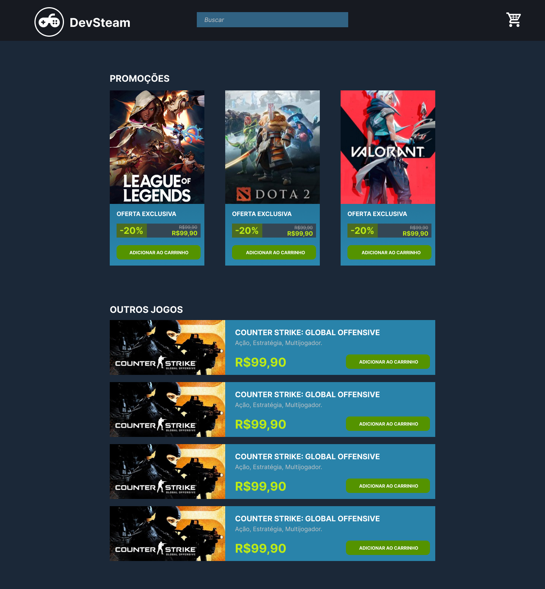

<h1 align="center"> DevSteam </h1>

Projeto desenvolvido durante o evento Semana da Evolução na Programação oferecido pelo Seja Dev.

  <a href="#-tecnologias">Tecnologias</a>&nbsp;&nbsp;&nbsp;|&nbsp;&nbsp;&nbsp;
  <a href="#-projeto">Projeto</a>&nbsp;&nbsp;&nbsp;|&nbsp;&nbsp;&nbsp;
  <a href="#-layout">Layout</a>&nbsp;&nbsp;&nbsp;|&nbsp;&nbsp;&nbsp;
  <a href="#memo-licença">Licença</a>

  

 

  

## 🚀 Tecnologias

Esse projeto foi desenvolvido com as seguintes tecnologias:

- JavaScript
- ReactJS
- NextJS
- NodeJS
- HTML e CSS

## 💻 Projeto

Esse projeto apresenta um clone da plataforma de jogos Steam.

## 🔖 Layout

Você pode visualizar o layout do projeto através [DESSE LINK](https://www.figma.com/file/ZgXjnDw8VuG4hmdgpU4Y91/DevSteam?node-id=3%3A55&mode=dev). É necessário ter conta no [Figma](https://figma.com) para acessá-lo.

## :memo: Licença

Esse projeto está sob a licença MIT.

---

Feito por [Isa Kaillany](https://github.com/IsaKaillany)
